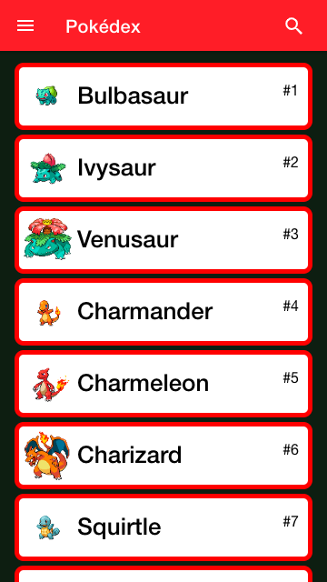
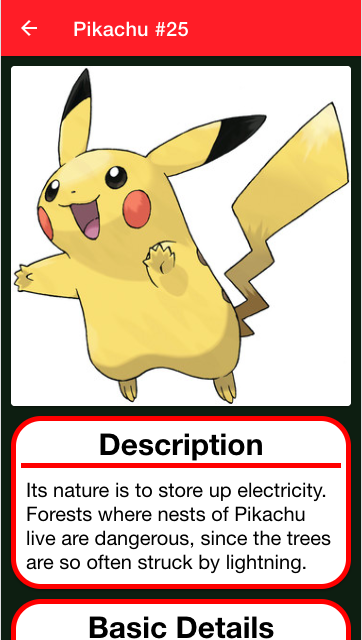
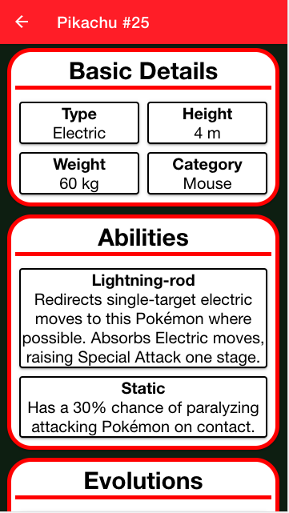
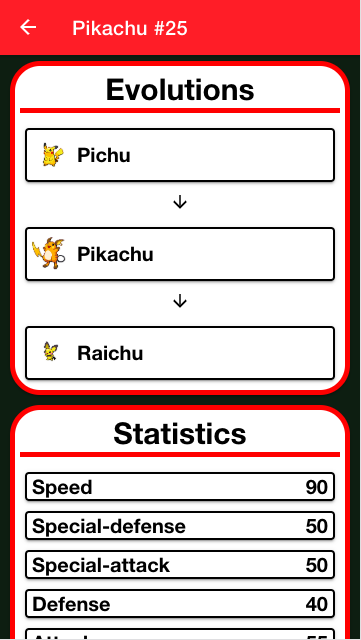
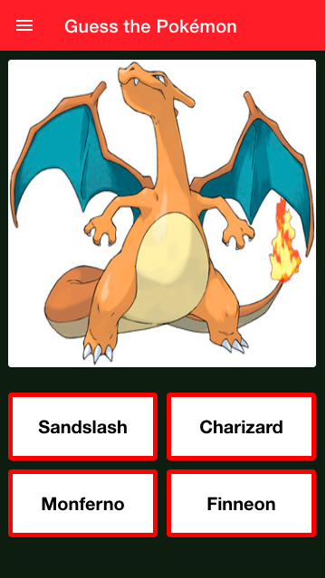

# Pokéverse
##### A Pokédex android application using Ionic and Angular using RESTful API
### API used
[PokéAPI](https://pokeapi.co/)

### APK File
Here's the link to download the apk file. [Pokéverse](https://drive.google.com/file/d/1yOFV8bxJZ5vY498LM2NVYRiFVLTOmFmP/view?usp=sharing)

### Screenshots
[](https://upload.wikimedia.org/wikipedia/commons/5/56/Tiger.50.jpg)

### Installation
Clone/Download the project and install the dependencies using npm install
```sh
$ cd Pokeverse
$ npm install
```
To run the application
```sh
$ npm start
```
This will open the application in your browser. The default path will be http://localhost:4200/

### Screenshots
<div>
  
  
  
  
  
</div>